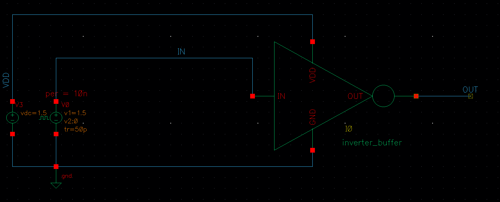

## Hello!
	This design i made by myself with a lot of inside stolen contents :> hahaha
## Ref
	[1] An Efficient Design of 3bit and 4bit Flash ADC, Volume 61– No.11, January 2013, International Journal of Computer Applications (0975 – 8887) by Arunkumar P Chavan, Rekha G and  P Narashimaraja.
	[2] THIẾT KẾ VÀ ĐÁNH GIÁ HỆ THỐNG SAR ADC 10 BIT THỰC HIỆN TRÊN PHẦN MỀM CADENCE, ĐỒ ÁN TỐT NGHIỆP NGÀNH CÔNG NGHỆ KỸ THUẬT MÁY TÍNH, by Nguyen Ngoc Hung, Nguyen Tai Nhan and suppervisor Truong Quang Phuc.
	[3] Two Stage MOS Amplifier - Explained, link: https://youtu.be/ahbx6ItwLdo?si=kmFqx0euDAVH3u0s, by Walid Issa Plus.
## NOTE:
	Instead of GND in 2-stage-op-amp, i have used VSS (-1.2V). Since from later simulation of the Schematic in Ref [1] [2], when i assign V- = 0V (or a number that less than 500mV), the op-amp didn't  work correct :<. 

Model lib:

	/home/buet/cadence/gpdk090_v4.6/models/spectre/gpdk090.scs

Fun fact, if you cannot find scs file, u can use ```find``` command to find it.
```
	find / -name gpdk090.scs
```
And output:
```
[buet@cadence ~]$ sudo find / -name gpdk090.scs
/home/buet/cadence/gpdk090_v4.6/models/spectre/gpdk090.scs
[buet@cadence ~]$ 
```
## Two-stage Op-amp
### Specifications:
Compensation capacitor, Load capatitor, Length:
|C_C|C_L| L |
|:-:|:-:|:-:|
|50fF | 100fF | 500nm |

W/L ratio, W for all CMOS (M1->M8):
|     |M1|M2|M3|M4|M5|M6|M7|M8|
|:-:  |:-:|:-:|:-:|:-:|:-:|:-: |:-: |:-:|
|W/L  | 3 | 3 | 5 | 5 | 6 | 77 | 47 | 6 |
|W(um)|1.5|1.5|2.5|2.5| 3 |38.5|23.5| 3 |

### Schematic


### Simulation Schematic Circuit

### Waveform:


## Logic Buffer
### Specifications:
| L | W (nMOS) | W (pMOS) |
|:-:|:-:|:-:|
| 280nm | 300nm |  600nm |
### Simulation Schematic Circuit

### Waveform:


## Inverter Buffer
### Specifications:
| L | W (nMOS) | W (pMOS) |
|:-:|:-:|:-:|
| 280nm | 300nm |  600nm |
### Schematic

### Simulation Schematic Circuit

### Waveform:


## Multiplexer 2->1
### Specifications:
| L | W (nMOS) | W (pMOS) |
|:-:|:-:|:-:|
| 280nm | 300nm |  600nm |
### Simulation Schematic Circuit
### Waveform:


## Encoder 7->1
### Specifications:
| L | W (nMOS) | W (pMOS) |
|:-:|:-:|:-:|
| 280nm | 300nm |  600nm |
### Simulation Schematic Circuit
### Waveform: